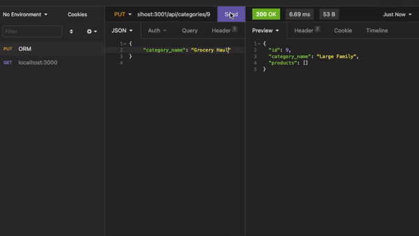

# E-Commerce Back End

[VIDEO DEMO](https://www.youtube.com/watch?v=2thS85Q71Q0)

## Table of Contents

- [Description](#description)
- [Installation](#installation)
- [License](#license)
- [Contact](#contact)

## Description

This back-end portion of an e-commerce application uses Object-Relational Mapping to allow categorical grouping and attribute search of products. All fields are easy to update, including product pricing and inventory information.

## Installation

Clone this repo and open it in a Node.js runtime environment where MySQL is also installed. Update credentials starting on line 8 of the index.js file to ensure a MySQL server connection. This repo includes a package.json. Run `npm install` to install all required dependencies. Delete the .EXAMPLE form the included .env.EXAMPLE file and update with MySQL credentials to ensure a connection to the database. Once dependencies are installed, connect to MySQL and create a database using the schema found in the DB file. Seed files exist in the seeds folder and can be updated by the user to reflect their current inventory. Run `node seeds/index.js` to seed the database. Add and update products, categories, and tags using the routes found in the files located in the routes/API folder.

## License

This project (and all code) is licensed under the [MIT license](https://opensource.org/licenses/MIT).

## Contact

If you have any questions feel free to reach out by [email](mailto:sissyhanks@yahoo.com) or visit my [personal website](https://github.com/sissyhanks).
